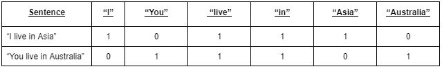
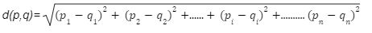
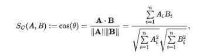

# Text-Document-Similarity-Detection-Without-Using-Python-ML-Libraries
Building similarity detection ML codes from scratch using linear algebra.

Creating a python program that will compute the text document similarity between different documents. The implementation will take a list of documents as an input text corpus, and it will compute a dictionary of words for the given corpus. Later, when a new document (i.e, search document) is provided, the implementation should provide a list of documents that are similar to the given search document, in descending order of their similarity with the search document. For computing similarity between any two documents in our question, we are using the following distance measures (optionally, you are using  other set measures as well).

1. dot product between the two vectors

2. distance norm (or Euclidean distance) between two vectors .e.g. || u − v ||

As part of answering the question, we can also compare and comment on which of the two methods (or any other measure if you have used some other measure) will perform better and what are the reasons for it.

#Answer:

Text Document Similarity is the procedure of matching one textual piece to another and determining their similarities. It amounts to assessing one or multiple texts’ or documents’ degree of proximity with another. This is a very important aspect of machine learning and linear algebra which is frequently used in fields like plagiarism checks, search engines, automated product suggestions for online customers, and even for filtering out the best candidate for a certain job role. (Pal, 2022) 
To find text similarities one needs to convert sentences into machine readable formats. The process is executed by breaking down the words from a sentence into datasets which are transformed into vectors so that the computer can use it to assess similarities. For example, the sentences “I live in Asia” and “You live in Australia” can be embedded as a list of words [“I”, “You”, “live”, “in”, “Asia”, “Australia” ] and can be vectorized with element 0 and 1 into machine readable form by the following approach according to their presence:

Vector distances can be estimated by using a variety of metrics to check for similarities. For our implementation, the following four metrics have been executed:

i) Euclidean Distance: The length of a line segment connecting two locations is referred to as the Euclidean distance. For an n dimensional Euclidean Space, the distance can be measured by the formula (Tabak, 2014):

From the equation it can be observed that the similarity score will decrease as the distance increases between two vectors in dimension “n”. To increase comparability between results the following equation was applied: 1(1 + d(p,q)) = similarity. As a result the output is bounded between 0 and 1, with 1 representing full similarity and 0 representing no similarity.

ii) Cosine Similarity: A basic measure of how similar two vectors in an inner product space are is called cosine similarity. If two embeddings are pointing approximately in the same direction or not can be determined by measuring the cosine of the angle between them. For two vectors A and B, it can be computed by the following formula:

 

When the embeddings are oriented in the same direction, their cosine similarity equals 1, because their angle is zero. When the embeddings are perpendicular to one another, the angle is 90 degrees, and the cosine similarity is 0. Finally, the cosine similarity is -1 when the angle is 180 degrees (Langenderfer, 2021). But for the word vectorization it will vary between the range of 0 and 1 as count values are not negative.
